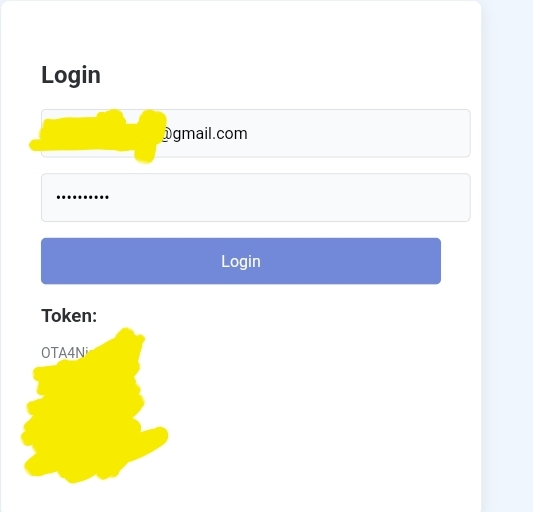

# Token Getter

## Description
Token Getter is a simple web interface that allows users to log in to their Discord account and retrieve an authentication token.

## Features
- Login Interface: Users can enter their Discord email address and password to log in.
- Token Retrieval: Once successfully logged in, the site displays the authentication token generated by Discord.

## Usage
1. Enter your Discord email address and password in the respective fields.
2. Click the "Login" button to log in.
3. Upon successful login, your authentication token will be displayed.

## Important Notes
- Two-Factor Authentication (2FA): Please note that this interface does not support accounts with Two-Factor Authentication enabled.
- No Code Theft: This project does not involve any code theft. It is built using Discord's public API.
- Educational Purpose: This project is intended for educational purposes only and should not be used for malicious activities.
- Disclaimer: The developer takes no responsibility for any misuse of this tool.

## How to Run Locally
1. Clone this GitHub repository to your local machine.
2. Open the `index.html` file in your web browser.

## Technologies Used
- HTML
- CSS
- JavaScript

## Screenshots

## Author
This project was developed by [NaySurGithub](https://github.com/NaySurGithub).

## License
This project is licensed under the MIT License. For more information, see the [LICENSE](LICENSE) file.
